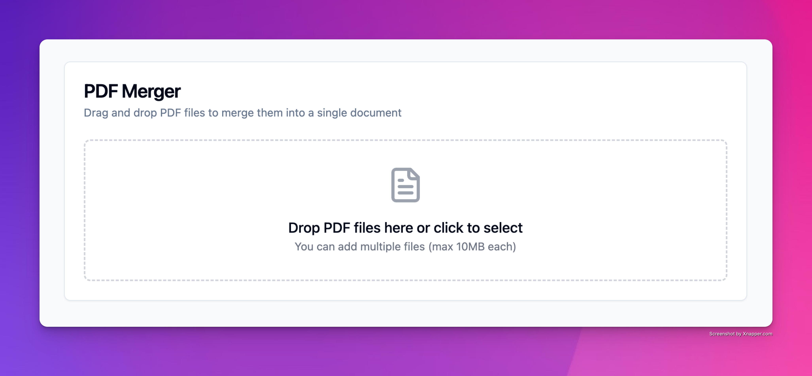

# PDF Merger Application

This application provides a simple interface to merge multiple PDF files into a single document using a web-based interface.

## Features

- Upload and merge multiple PDF files
- Download the merged PDF
- Automatic cleanup of temporary files
- Cross-platform compatibility

## Tech Stack

### Frontend
- React with Vite for fast development
- TailwindCSS for styling
- Responsive and accessible design

### Backend
- Flask (Python) for handling requests
- PyPDF2 for PDF merging
- CORS enabled for cross-origin requests

## Setup and Installation

### Prerequisites
- Node.js (v14 or higher)
- Python (v3.7 or higher)
- pip (Python package manager)

### Backend Setup
1. Navigate to the backend directory:
   ```bash
   cd pdf-merger/backend
   ```
2. Create a virtual environment:
   ```bash
   python -m venv venv
   ```
3. Activate the virtual environment:
   - On Windows:
     ```bash
     venv\Scripts\activate
     ```
   - On macOS/Linux:
     ```bash
     source venv/bin/activate
     ```
4. Install the required Python packages:
   ```bash
   pip install -r requirements.txt
   ```
5. Run the Flask application:
   ```bash
   flask run
   ```

### Frontend Setup
1. Navigate to the frontend directory:
   ```bash
   cd pdf-merger/frontend
   ```
2. Install the required Node.js packages:
   ```bash
   npm install
   ```
3. Start the development server:
   ```bash
   npm run dev
   ```

## Usage

1. Open your web browser and navigate to the frontend development server (usually `http://localhost:3000`).
2. Upload the PDF files you wish to merge.
3. Click the "Merge" button to process the files.
4. Download the merged PDF file.


